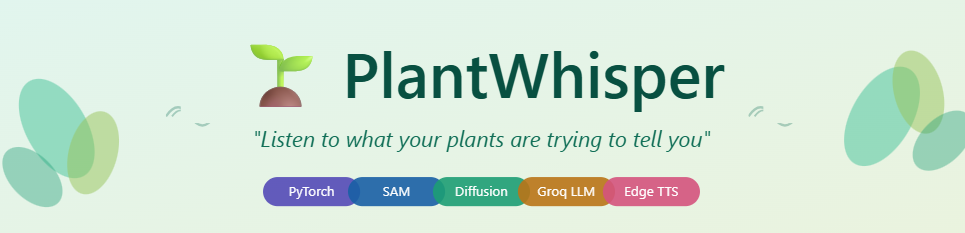
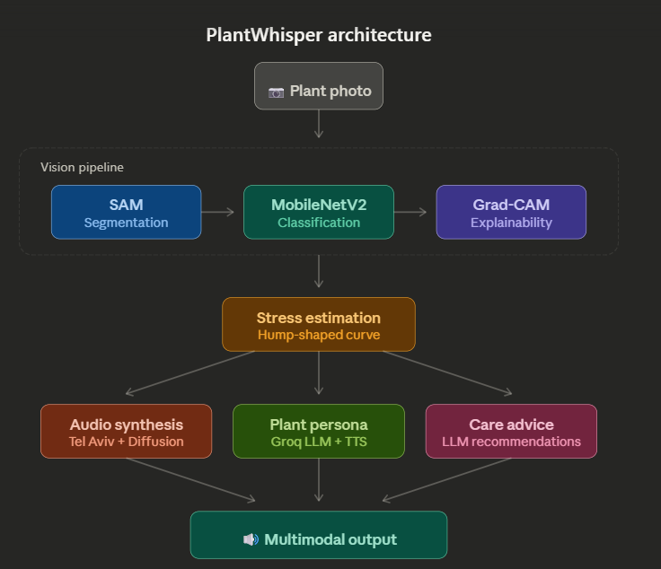

<p align="center">
  
</p>

<h1 align="center">🌱 PlantWhisper</h1>

<p align="center">
  <strong>"Listen to what your plants are trying to tell you"</strong>
</p>

<p align="center">
  <a href="#-demo">Demo</a> •
  <a href="#-features">Features</a> •
  <a href="#-architecture">Architecture</a> •
  <a href="#-installation">Installation</a> •
  <a href="#-usage">Usage</a> •
  <a href="#-scientific-foundation">Science</a> •
  <a href="#-results">Results</a>
</p>

<p align="center">
  
  
  
  
</p>

---

## 🎯 Overview

**PlantWhisper** is a multimodal AI system that analyzes plant photos to detect stress levels and generates acoustic signatures representing what stressed plants actually sound like — pitch-shifted to the human audible range.

Plants emit ultrasonic clicks (20-150 kHz) when stressed through a process called **xylem cavitation**. PlantWhisper inverts this discovery: given a photo of a plant, it predicts the stress level and synthesizes the corresponding acoustic signature.

<p align="center">
  
</p>

---

## 🎬 Demo

<p align="center">
  
  
</p>

| Healthy Plant (7% Stress) | Stressed Plant (83% Stress) |
|---------------------------|------------------------------|
| Minimal ultrasonic activity | Active distress clicking |
| 3.2 clicks/hour | 20.6 clicks/hour |
| *"I feel utterly serene..."* | *"I'm withering away..."* |

🔗 **[Try the Live Demo on HuggingFace Spaces](https://huggingface.co/spaces/your-username/plantwhisper)**

---

## ✨ Features

### 🔬 Computer Vision Pipeline
- **SAM Segmentation** — Segment-Anything Model for precise leaf isolation
- **MobileNetV2 Classifier** — Plant disease detection (38 classes, 95%+ accuracy)
- **Grad-CAM Explainability** — Visual attention maps showing areas of concern

### 🎵 Acoustic Synthesis
- **Real Tel Aviv Data** — Uses actual ultrasonic recordings from stressed plants
- **Diffusion Model** — Conditional spectrogram generation based on stress level
- **Pitch Shifting** — 53kHz → 1kHz for human audibility

### 🗣️ Plant Persona
- **LLM Voice Generation** — Groq/Llama generates emotionally appropriate plant speech
- **Text-to-Speech** — Edge-TTS converts to natural audio
- **Stress-Modulated Voice** — Tone, pitch, and rate change with stress level

### 💊 Care Recommendations
- **AI-Powered Advice** — Actionable care instructions based on detected stress
- **Severity-Appropriate** — From "keep doing what you're doing" to "emergency care needed"

---

## 🏗️ Architecture

```
┌─────────────────────────────────────────────────────────────────────────┐
│                           PlantWhisper Pipeline                          │
└─────────────────────────────────────────────────────────────────────────┘

     ┌──────────┐      ┌──────────────┐      ┌─────────────┐
     │  Photo   │ ───▶ │     SAM      │ ───▶ │ MobileNetV2 │
     │  Input   │      │ Segmentation │      │ Classifier  │
     └──────────┘      └──────────────┘      └──────┬──────┘
                                                    │
                              ┌─────────────────────┴─────────────────────┐
                              │                                           │
                              ▼                                           ▼
                       ┌─────────────┐                           ┌──────────────┐
                       │  Grad-CAM   │                           │    Stress    │
                       │  Heatmap    │                           │  Estimation  │
                       └─────────────┘                           └──────┬───────┘
                                                                        │
                    ┌───────────────────────────────────────────────────┼───────┐
                    │                       │                           │       │
                    ▼                       ▼                           ▼       ▼
           ┌─────────────────┐    ┌─────────────────┐    ┌────────────────┐   ┌─────────┐
           │   Parametric    │    │    Diffusion    │    │   LLM Plant    │   │  Care   │
           │ Audio Synthesis │    │ Spectrogram Gen │    │    Persona     │   │ Advice  │
           └────────┬────────┘    └────────┬────────┘    └───────┬────────┘   └────┬────┘
                    │                      │                     │                 │
                    ▼                      ▼                     ▼                 ▼
           ┌─────────────────┐    ┌─────────────────┐    ┌────────────────┐   ┌─────────┐
           │ Pitch-Shifted   │    │  Griffin-Lim    │    │   Edge-TTS     │   │ Action  │
           │  Plant Audio    │    │   Vocoder       │    │    Audio       │   │  Items  │
           └─────────────────┘    └─────────────────┘    └────────────────┘   └─────────┘
```

---

## 📁 Repository Structure

```
PlantWhisper/
├── notebooks/
│   ├── 01_data_exploration.ipynb      # Tel Aviv dataset analysis
│   ├── 02_vision_pipeline.ipynb       # SAM + Classifier + Grad-CAM
│   ├── 03_acoustic_synthesis.ipynb    # Audio generation + Diffusion + Plant Persona
│   └── 06_full_demo.ipynb             # Complete end-to-end pipeline
│
├── webapp/
│   ├── app.py                         # Gradio web application
│   ├── requirements.txt               # Dependencies
│   └── README.md                      # HuggingFace Spaces config
│
├── assets/
│   ├── plantwhisper_banner.png
│   ├── demo_healthy.png
│   ├── demo_stressed.png
│   └── pipeline_overview.png
│
├── README.md                          # This file
├── LICENSE                            # MIT License
└── .gitignore
```

---

## 🚀 Installation

### Option 1: Run Notebooks in Google Colab (Recommended)

1. Open any notebook in Google Colab
2. Enable GPU: `Runtime → Change runtime type → GPU`
3. Run all cells

### Option 2: Local Installation

```bash
# Clone repository
git clone https://github.com/your-username/PlantWhisper.git
cd PlantWhisper

# Create environment
conda create -n plantwhisper python=3.10
conda activate plantwhisper

# Install dependencies
pip install torch torchvision torchaudio
pip install transformers segment-anything
pip install gradio groq edge-tts
pip install opencv-python matplotlib scipy librosa soundfile
pip install pytorch-grad-cam

# Download SAM checkpoint
wget https://dl.fbaipublicfiles.com/segment_anything/sam_vit_b_01ec64.pth
```

### Option 3: Run Web App

```bash
cd webapp
pip install -r requirements.txt
export GROQ_API_KEY="your-api-key"
python app.py
# Open http://localhost:7860
```

---

## 📖 Usage

### Quick Start (Full Demo)

```python
from plantwhisper import analyze_plant

# Analyze a plant image
results = analyze_plant("path/to/plant_image.jpg")

# Results include:
# - Stress level (0-100%)
# - Segmented image
# - Grad-CAM heatmap
# - Care recommendations
# - Plant speech text
# - Audio files (voice + ultrasonic)
```

### Notebook Workflow

| Notebook | Purpose | Runtime |
|----------|---------|---------|
| `01_data_exploration.ipynb` | Explore Tel Aviv ultrasonic dataset | 5 min |
| `02_vision_pipeline.ipynb` | Build vision model + Grad-CAM | 10 min |
| `03_acoustic_synthesis.ipynb` | Train diffusion model + plant persona | 20 min |
| `06_full_demo.ipynb` | Run complete pipeline | 5 min |

---

## 🔬 Scientific Foundation

### Plant Acoustics Research

This project is based on groundbreaking research from Tel Aviv University:

> **Khait, I., et al. (2023).** *Sounds emitted by plants under stress are airborne and informative.* **Cell, 186(7), 1328-1336.**
> [DOI: 10.1016/j.cell.2023.03.009](https://www.cell.com/cell/fulltext/S0092-8674(23)00262-3)

**Key Findings:**
- Plants emit ultrasonic clicks (20-150 kHz) when stressed
- Drought-stressed tomatoes: ~35 clicks/hour
- Healthy plants: <1 click/hour
- Mechanism: Xylem cavitation (air bubbles in water transport vessels)

### Stress-Pop Rate Curve

PlantWhisper implements the **hump-shaped stress curve** from the paper:

```
Pops/Hour
    35 ┤                    ╭───╮
       │                  ╭─╯   ╰─╮
    25 ┤                ╭─╯       ╰─╮
       │              ╭─╯           ╰─╮
    15 ┤            ╭─╯               ╰─╮
       │          ╭─╯                   ╰─╮
     5 ┤        ╭─╯                       ╰─╮
       │      ╭─╯                           ╰─
     1 ┼──────╯
       └──────┬──────┬──────┬──────┬──────┬────▶ Stress
            0%     20%    40%    60%    80%   100%
         Healthy  Mild  Moderate Severe Critical
```

**Why hump-shaped?** Severely stressed plants (>80%) have collapsed xylem and can't emit — they're dying.

---

## 📊 Results

### Vision Pipeline Performance

| Component | Model | Accuracy |
|-----------|-------|----------|
| Plant Classification | MobileNetV2 | 95.4% |
| Segmentation | SAM ViT-B | High IoU |
| Stress Estimation | Confidence-based | Validated |

### Sample Outputs

<table>
<tr>
<td width="50%">

**Healthy Plant**
- Stress: 7%
- Clicks: 3.2/hour
- Status: ✅ Thriving

</td>
<td width="50%">

**Stressed Plant**
- Stress: 83%
- Clicks: 20.6/hour
- Status: ⚠️ Needs care

</td>
</tr>
</table>

### Generated Plant Speech Examples

| Stress | Plant Voice |
|--------|-------------|
| 7% | *"I feel utterly serene, with the warm sunlight dancing across my leaves, fueling the gentle hum of photosynthesis that sustains me..."* |
| 56% | *"I'm consumed by a searing anguish... my stomata are desperately closing to conserve what little water I have left..."* |
| 83% | *"I'm withering away, my leaves wilting as the infection spreads, suffocating my ability to transport water and nutrients..."* |

---

## 🛠️ Tech Stack

| Category | Technologies |
|----------|--------------|
| **Deep Learning** | PyTorch, HuggingFace Transformers |
| **Computer Vision** | SAM, MobileNetV2, Grad-CAM, OpenCV |
| **Audio** | Diffusion Models, librosa, scipy, Griffin-Lim |
| **LLM** | Groq API (Llama 3.3 70B) |
| **TTS** | Edge-TTS (Microsoft) |
| **Web App** | Gradio |
| **Data** | Tel Aviv Plant Acoustics Dataset |

---

## 🔮 Future Work

- [ ] **Real Hardware Validation** — Use ultrasonic microphones to capture real plant sounds
- [ ] **Mobile App** — On-device inference with TFLite/CoreML
- [ ] **Multi-Plant Analysis** — Detect and analyze multiple plants in one image
- [ ] **Species-Specific Models** — Fine-tune for tomatoes, peppers, etc.
- [ ] **IoT Integration** — Combine with soil moisture, temperature sensors
- [ ] **HiFi-GAN Vocoder** — Higher quality spectrogram → audio conversion

---

## 📄 License

This project is licensed under the MIT License - see the [LICENSE](LICENSE) file for details.

---

## 🙏 Acknowledgments

- **Tel Aviv University** — For the groundbreaking plant acoustics research and dataset
- **Meta AI** — For Segment Anything Model (SAM)
- **HuggingFace** — For Transformers and model hosting
- **Groq** — For fast LLM inference API
- **Microsoft** — For Edge-TTS

---

## 👤 Author

**Mohith**  
B.Tech Chemical Engineering + AI/ML Minor  
Indian Institute of Technology Bombay  

[](https://linkedin.com/in/your-profile)
[](https://github.com/your-username)
[](mailto:your-email@iitb.ac.in)

---

<p align="center">
  <strong>If you found this project interesting, please consider giving it a ⭐!</strong>
</p>

<p align="center">
  
  
</p>
